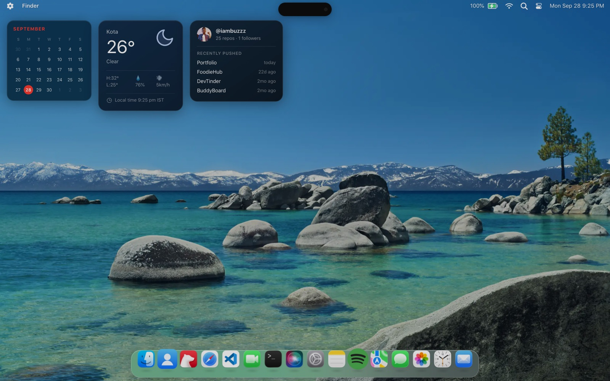
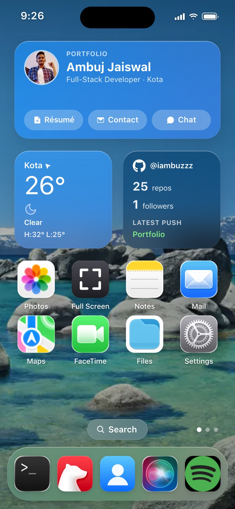

<div align="center">

# macOS Portfolio — Ambuj Jaiswal

**An interactive developer portfolio that runs as a macOS Tahoe desktop on laptops and turns into an iOS home screen on phones.**

Open apps, explore projects in Safari, browse source code in VS Code, play music, or just ask Siri about me.

[**Live site → iambuzzdev.in**](https://iambuzzdev.in)


</div>

<p align="center">
  
  &nbsp;
  
</p>

---

## Table of contents

- [Highlights](#highlights)
- [Apps](#apps)
- [Tech stack](#tech-stack)
- [Project structure](#project-structure)
- [Serverless API](#serverless-api)
- [Usage](#usage)
- [Contact](#contact)

## Highlights

**Two complete interfaces, one codebase**
- **Laptop / desktop:** a macOS Tahoe desktop with a login screen, menu bar, magnifying dock, draggable and resizable windows, Launchpad, Spotlight, Control Center, Notification Center and desktop widgets.
- **Phone:** an iOS home screen with swipeable pages, an App Library, Dynamic Island, a gesture home bar, an app switcher, and pull-down Control Center and Notification Center.

**Interactive, not just decorative**
- **Siri** answers questions about me with an LLM (via Groq, with built-in offline answers as a fallback), accepts voice input (Whisper transcription) and can open apps, e.g. "open maps".
- **Terminal** is a sandboxed shell with 50+ commands:
  - `projects`, `skills`, `resume`, `neofetch`, a virtual file system (`ls`, `cd`, `cat`, `tree`);
  - music controls (`play`, `next`, `vol`);
  - full-screen programs: `htop`, `snake`, `typing-test`, `matrix`.
- **Spotify** streams real songs, and **Safari** loads my live projects in the browser.
- **VS Code** opens each project's source: github1s on desktop, and a native file browser on touch screens.
- **17 achievements** to unlock while exploring, tracked under Settings → Screen Time.

**System settings that actually work**
- Light / Dark mode, wallpapers, and a brightness slider that dims the whole screen.
- **Reduce Motion** and **Reduce Transparency** (Solid UI). Reduce Motion is on by default on phones.
- **Recruiter Mode:** skips the login screen, reduces motion and opens About first.
- **Full Screen** from the Control Center or `Cmd/Ctrl + F`. **Spotlight** with `Cmd/Ctrl + Space`.

**Performance**
- Every app is code-split with `React.lazy`, so only what you open is downloaded.
- Images are WebP and the SF Pro font is subset to WOFF2.
- Off-screen phone pages and hidden apps stop rendering, and the camera pauses when FaceTime is in the background.

## Apps

| App | What it does |
|---|---|
| **About Me** | Bio, education, skills, projects, certifications and links |
| **Safari** | Opens live project demos; checks whether a site allows embedding and falls back gracefully |
| **VS Code** | Browse each project's source code, one tab per project |
| **Terminal** | Sandboxed shell with portfolio commands, a virtual file system and mini-games |
| **Siri** | AI assistant about me, with voice input |
| **Messages** | Chat with an AI assistant that answers questions about me, plus threads for projects and coding profiles |
| **Mail** | Contact form that delivers straight to my inbox (falls back to `mailto:`) |
| **Finder** | Browse projects, screenshots, certificates and the résumé, with Quick Look |
| **Photos** | Project screenshots and certificates in albums |
| **Bear** | Markdown notes on my profile, education, skills, certifications and every project |
| **Spotify** | Search and stream music |
| **Maps** | Where I'm based, with place search and an OpenStreetMap fallback |
| **FaceTime** | Live camera with photo capture |
| **Notes · Clock · System Settings** | The everyday essentials, all functional |

## Tech stack

| Area | Tools |
|---|---|
| UI | React 18, TypeScript |
| State | Zustand (with `persist` for preferences and progress) |
| Styling | UnoCSS (with Phosphor icon sets), plain CSS for the glass/iOS surfaces |
| Animation | Framer Motion |
| Build | Vite 5 |
| Backend | Vercel Edge/Serverless Functions (`api/`) |
| Services | Groq (LLM + Whisper), Web3Forms, Google Maps Embed API, GitHub REST API, JioSaavn |
| Hosting | Vercel |

## Project structure

```
├── api/                    # Vercel functions (also served by Vite in dev/preview)
│   ├── _lib/guard.ts       # same-origin check + per-IP rate limiting
│   ├── siri/               # chat + voice transcription (Groq)
│   ├── messages/chat.ts    # "chat with Ambuj" (Groq)
│   ├── music.ts            # music search and streams
│   ├── github.ts           # GitHub stats, CDN-cached
│   └── frame-check.ts      # can this site be embedded in Safari?
├── public/                 # wallpapers, icons, project screenshots, résumé
├── scripts/                # asset optimisation, OG image generation
└── src/
    ├── data/               # profile, Siri and Messages content
    ├── pages/              # Boot, Login, Desktop (laptop) and Mobile (phone) shells
    ├── components/
    │   ├── apps/           # one file per app
    │   ├── dock/ menus/    # macOS dock, menu bar, Control Center
    │   ├── mobile/         # iOS status bar, widgets, App Library
    │   └── widgets/        # desktop widgets
    ├── terminal/           # command registry, virtual FS, full-screen programs
    ├── settings/           # preferences, achievements, System Settings panels
    ├── stores/             # Zustand stores (windows, dock, music, widgets…)
    └── styles/             # global, component and mobile CSS
```

## Serverless API

All routes live in `api/` and run as Vercel functions. Vite mounts the same handlers locally, so development and production behave identically.

| Route | Purpose | Protection |
|---|---|---|
| `POST /api/siri/chat` | Answers questions about me (Groq LLM with model fallback) | Same-origin + rate limit |
| `POST /api/siri/transcribe` | Speech-to-text (`whisper-large-v3-turbo`) | Same-origin + rate limit |
| `POST /api/messages/chat` | Conversational replies for the Messages app | Same-origin + rate limit |
| `GET /api/music` | Music search, playlists and stream URLs | Same-origin + rate limit, CDN-cached |
| `GET /api/github` | Profile stats and recently pushed repos | Same-origin + rate limit, CDN-cached (1 h) |
| `GET /api/frame-check` | Checks a URL's framing headers before Safari loads it | Same-origin + rate limit |

## Usage

This is my personal portfolio. The code is public so you can see how it's built. Please don't copy it or redeploy it as your own portfolio.

macOS, iOS and the app names and icons shown are trademarks of their respective owners. This project is not affiliated with Apple or any other company.

## Contact

**Ambuj Jaiswal**, Full-Stack Developer

[ambujjais1@gmail.com](mailto:ambujjais1@gmail.com) · [GitHub](https://github.com/iambuzzz) · [LinkedIn](https://www.linkedin.com/in/ambuj-jaiswal-68385a290)
